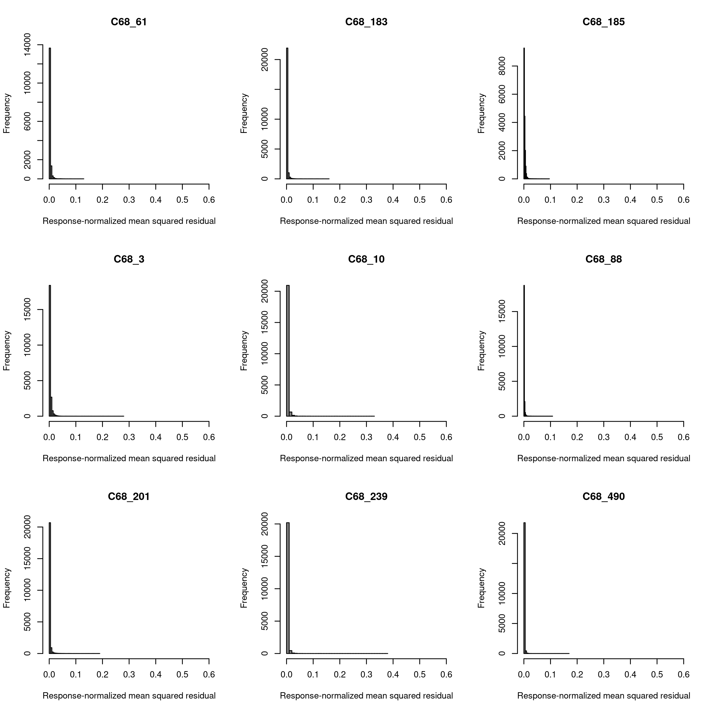
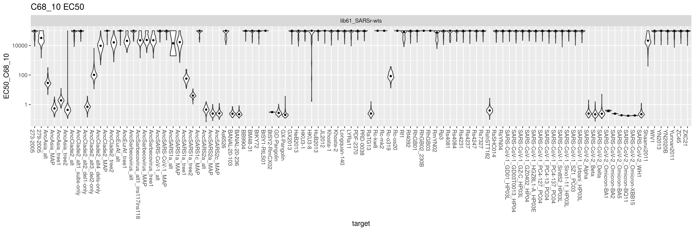

Compute per-barcode binding to mAb samples
================
Tyler Starr
5/12/2022

This notebook reads in per-barcode counts from `count_variants.ipynb`
for sera-binding titration experiments, computes functional scores for
RBD binding values via delta-AUC metrics, and does some basic QC on
variant binding functional scores.

``` r
#list of packages to install/load
packages = c("yaml","data.table","tidyverse","gridExtra")
#install any packages not already installed
installed_packages <- packages %in% rownames(installed.packages())
if(any(installed_packages == F)){
  install.packages(packages[!installed_packages],
                   lib=c(paste("/uufs/chpc.utah.edu/common/home/",Sys.getenv("USER"),"/RLibs/",Sys.getenv("R_VERSION"),sep="")),
                   repos=c("http://cran.us.r-project.org"))
}
#load packages
invisible(lapply(packages, library, character.only=T))

knitr::opts_chunk$set(echo = T)
knitr::opts_chunk$set(dev.args = list(png = list(type = "cairo")))

#read in config file
config <- read_yaml("config.yaml")

#make output directory
if(!file.exists(config$mAb_EC50_dir)){
  dir.create(file.path(config$mAb_EC50_dir))
}
```

Session info for reproducing environment:

``` r
sessionInfo()
```

    ## R version 4.1.3 (2022-03-10)
    ## Platform: x86_64-pc-linux-gnu (64-bit)
    ## Running under: Rocky Linux 8.8 (Green Obsidian)
    ## 
    ## Matrix products: default
    ## BLAS/LAPACK: /uufs/chpc.utah.edu/sys/spack/linux-rocky8-nehalem/gcc-8.5.0/intel-oneapi-mkl-2021.4.0-h43nkmwzvaltaa6ii5l7n6e7ruvjbmnv/mkl/2021.4.0/lib/intel64/libmkl_rt.so.1
    ## 
    ## locale:
    ##  [1] LC_CTYPE=en_US.UTF-8       LC_NUMERIC=C              
    ##  [3] LC_TIME=en_US.UTF-8        LC_COLLATE=en_US.UTF-8    
    ##  [5] LC_MONETARY=en_US.UTF-8    LC_MESSAGES=en_US.UTF-8   
    ##  [7] LC_PAPER=en_US.UTF-8       LC_NAME=C                 
    ##  [9] LC_ADDRESS=C               LC_TELEPHONE=C            
    ## [11] LC_MEASUREMENT=en_US.UTF-8 LC_IDENTIFICATION=C       
    ## 
    ## attached base packages:
    ## [1] stats     graphics  grDevices utils     datasets  methods   base     
    ## 
    ## other attached packages:
    ##  [1] gridExtra_2.3     forcats_0.5.1     stringr_1.4.0     dplyr_1.0.8      
    ##  [5] purrr_0.3.4       readr_2.1.2       tidyr_1.2.0       tibble_3.1.6     
    ##  [9] ggplot2_3.4.1     tidyverse_1.3.1   data.table_1.14.2 yaml_2.3.5       
    ## 
    ## loaded via a namespace (and not attached):
    ##  [1] tidyselect_1.1.2 xfun_0.30        haven_2.4.3      colorspace_2.0-3
    ##  [5] vctrs_0.5.2      generics_0.1.2   htmltools_0.5.2  utf8_1.2.2      
    ##  [9] rlang_1.0.6      pillar_1.7.0     glue_1.6.2       withr_2.5.0     
    ## [13] DBI_1.1.2        dbplyr_2.1.1     modelr_0.1.8     readxl_1.3.1    
    ## [17] lifecycle_1.0.3  munsell_0.5.0    gtable_0.3.0     cellranger_1.1.0
    ## [21] rvest_1.0.2      evaluate_0.15    knitr_1.37       tzdb_0.2.0      
    ## [25] fastmap_1.1.0    fansi_1.0.2      broom_0.7.12     Rcpp_1.0.11     
    ## [29] backports_1.4.1  scales_1.2.1     jsonlite_1.8.7   fs_1.5.2        
    ## [33] hms_1.1.1        digest_0.6.29    stringi_1.7.6    grid_4.1.3      
    ## [37] cli_3.6.0        tools_4.1.3      magrittr_2.0.2   crayon_1.5.0    
    ## [41] pkgconfig_2.0.3  ellipsis_0.3.2   xml2_1.3.3       reprex_2.0.1    
    ## [45] lubridate_1.8.0  rstudioapi_0.13  assertthat_0.2.1 rmarkdown_2.13  
    ## [49] httr_1.4.7       R6_2.5.1         compiler_4.1.3

## Setup

First, we will read in metadata on our sort samples, the table giving
number of reads of each barcode in each of the sort bins, and the
barcode-variant lookup tables, and merge these tables together.

``` r
#read dataframe with list of barcode runs
barcode_runs <- read.csv(file=config$barcode_runs,stringsAsFactors=F); barcode_runs <- subset(barcode_runs, select=-c(R1))

#read file giving count of each barcode in each sort partition
counts <- data.table(read.csv(file=config$variant_counts_file,stringsAsFactors=F))

#read in barcode-variant lookup tables
dt <- data.table(read.csv(file=config$codon_variant_table_file_lib61,stringsAsFactors=F))
setkey(dt,barcode,library)

dt <- merge(counts, dt, by=c("library","barcode")); rm(counts)

samples_C68_61 <- data.frame(sample=sort(unique(paste(rep("C68_61",6),formatC(barcode_runs[barcode_runs$sample_type=="C68_61","concentration"], width=2,flag="0"),sep="_"))),conc=c(10000, 400, 16, 0.64, 0.0256, 0))

samples_C68_183 <- data.frame(sample=sort(unique(paste(rep("C68_183",6),formatC(barcode_runs[barcode_runs$sample_type=="C68_183","concentration"], width=2,flag="0"),sep="_"))),conc=c(10000, 400, 16, 0.64, 0.0256, 0))

samples_C68_185 <- data.frame(sample=sort(unique(paste(rep("C68_185",6),formatC(barcode_runs[barcode_runs$sample_type=="C68_185","concentration"], width=2,flag="0"),sep="_"))),conc=c(10000, 400, 16, 0.64, 0.0256, 0))

samples_C68_3 <- data.frame(sample=sort(unique(paste(rep("C68_3",6),formatC(barcode_runs[barcode_runs$sample_type=="C68_61","concentration"], width=2,flag="0"),sep="_"))),conc=c(10000, 400, 16, 0.64, 0.0256, 0))

samples_C68_10 <- data.frame(sample=sort(unique(paste(rep("C68_10",6),formatC(barcode_runs[barcode_runs$sample_type=="C68_10","concentration"], width=2,flag="0"),sep="_"))),conc=c(10000, 400, 16, 0.64, 0.0256, 0))

samples_C68_88 <- data.frame(sample=sort(unique(paste(rep("C68_88",6),formatC(barcode_runs[barcode_runs$sample_type=="C68_88","concentration"], width=2,flag="0"),sep="_"))),conc=c(10000, 400, 16, 0.64, 0.0256, 0))

samples_C68_201 <- data.frame(sample=sort(unique(paste(rep("C68_201",6),formatC(barcode_runs[barcode_runs$sample_type=="C68_201","concentration"], width=2,flag="0"),sep="_"))),conc=c(10000, 400, 16, 0.64, 0.0256, 0))

samples_C68_239 <- data.frame(sample=sort(unique(paste(rep("C68_239",6),formatC(barcode_runs[barcode_runs$sample_type=="C68_239","concentration"], width=2,flag="0"),sep="_"))),conc=c(10000, 400, 16, 0.64, 0.0256, 0))

samples_C68_490 <- data.frame(sample=sort(unique(paste(rep("C68_490",6),formatC(barcode_runs[barcode_runs$sample_type=="C68_490","concentration"], width=2,flag="0"),sep="_"))),conc=c(10000, 400, 16, 0.64, 0.0256, 0))
```

Convert from Illumina read counts to estimates of the number of cells
that were sorted into a bin, and add some other useful information to
our data frame.

``` r
#for each bin, normalize the read counts to the observed ratio of cell recovery among bins
for(i in 1:nrow(barcode_runs)){
  lib <- as.character(barcode_runs$library[i])
  bin <- as.character(barcode_runs$sample[i])
  ratio <- sum(dt[library==lib & sample==bin,"count"])/barcode_runs$number_cells[i]
  if(ratio<1){ #if there are fewer reads from a FACS bin than cells sorted
    dt[library==lib & sample==bin, count.norm := as.numeric(count)] #don't normalize cell counts, make count.norm the same as count
    print(paste("reads < cells for",lib,bin,", un-normalized (ratio",ratio,")")) #print to console to inform of undersampled bins
  }else{
    dt[library==lib & sample==bin, count.norm := as.numeric(count/ratio)] #normalize read counts by the average read:cell ratio, report in new "count.norm" column
    print(paste("read:cell ratio for",lib,bin,"is",ratio))
  }
}
```

    ## [1] "read:cell ratio for lib61_SARSr-wts C68_3_01_bin1 is 1.90162924713764"
    ## [1] "read:cell ratio for lib61_SARSr-wts C68_3_01_bin2 is 6.56682863590299"
    ## [1] "read:cell ratio for lib61_SARSr-wts C68_3_01_bin3 is 6.50915001203949"
    ## [1] "read:cell ratio for lib61_SARSr-wts C68_3_01_bin4 is 15.2117138742199"
    ## [1] "read:cell ratio for lib61_SARSr-wts C68_3_02_bin1 is 2.49749149432318"
    ## [1] "read:cell ratio for lib61_SARSr-wts C68_3_02_bin2 is 8.63144492726824"
    ## [1] "read:cell ratio for lib61_SARSr-wts C68_3_02_bin3 is 5.09264033264033"
    ## [1] "read:cell ratio for lib61_SARSr-wts C68_3_02_bin4 is 2.60033010136919"
    ## [1] "read:cell ratio for lib61_SARSr-wts C68_3_03_bin1 is 1.9846242175918"
    ## [1] "read:cell ratio for lib61_SARSr-wts C68_3_03_bin2 is 2.46669694085181"
    ## [1] "read:cell ratio for lib61_SARSr-wts C68_3_03_bin3 is 2.26068095402696"
    ## [1] "read:cell ratio for lib61_SARSr-wts C68_3_03_bin4 is 1.95356632210581"
    ## [1] "read:cell ratio for lib61_SARSr-wts C68_3_04_bin1 is 2.21509202481258"
    ## [1] "read:cell ratio for lib61_SARSr-wts C68_3_04_bin2 is 2.73634652613465"
    ## [1] "read:cell ratio for lib61_SARSr-wts C68_3_04_bin3 is 2.40807150198209"
    ## [1] "read:cell ratio for lib61_SARSr-wts C68_3_04_bin4 is 6.11764705882353"
    ## [1] "read:cell ratio for lib61_SARSr-wts C68_3_05_bin1 is 1.62598766841745"
    ## [1] "read:cell ratio for lib61_SARSr-wts C68_3_05_bin2 is 3.07014382803856"
    ## [1] "read:cell ratio for lib61_SARSr-wts C68_3_05_bin3 is 4.88888888888889"
    ## [1] "read:cell ratio for lib61_SARSr-wts C68_3_05_bin4 is 81.5"
    ## [1] "read:cell ratio for lib61_SARSr-wts C68_3_06_bin1 is 2.32435937111577"
    ## [1] "read:cell ratio for lib61_SARSr-wts C68_3_06_bin2 is 3.25406984496406"
    ## [1] "read:cell ratio for lib61_SARSr-wts C68_3_06_bin3 is 2.02941176470588"
    ## [1] "reads < cells for lib61_SARSr-wts C68_3_06_bin4 , un-normalized (ratio 0.1 )"
    ## [1] "read:cell ratio for lib61_SARSr-wts C68_183_01_bin1 is 2.73760890680042"
    ## [1] "read:cell ratio for lib61_SARSr-wts C68_183_01_bin2 is 2.06527210918463"
    ## [1] "read:cell ratio for lib61_SARSr-wts C68_183_01_bin3 is 4.90597416199232"
    ## [1] "read:cell ratio for lib61_SARSr-wts C68_183_01_bin4 is 3.61528688108266"
    ## [1] "read:cell ratio for lib61_SARSr-wts C68_183_02_bin1 is 2.1960082363765"
    ## [1] "read:cell ratio for lib61_SARSr-wts C68_183_02_bin2 is 1.00363422560902"
    ## [1] "read:cell ratio for lib61_SARSr-wts C68_183_02_bin3 is 7.23480702906881"
    ## [1] "read:cell ratio for lib61_SARSr-wts C68_183_02_bin4 is 6.25334037840733"
    ## [1] "read:cell ratio for lib61_SARSr-wts C68_183_03_bin1 is 6.15917054131235"
    ## [1] "read:cell ratio for lib61_SARSr-wts C68_183_03_bin2 is 1.53032789664643"
    ## [1] "read:cell ratio for lib61_SARSr-wts C68_183_03_bin3 is 5.50470383153946"
    ## [1] "read:cell ratio for lib61_SARSr-wts C68_183_03_bin4 is 5.96376811594203"
    ## [1] "read:cell ratio for lib61_SARSr-wts C68_183_04_bin1 is 1.28069259549291"
    ## [1] "read:cell ratio for lib61_SARSr-wts C68_183_04_bin2 is 1.98679301992539"
    ## [1] "read:cell ratio for lib61_SARSr-wts C68_183_04_bin3 is 16.780121444551"
    ## [1] "read:cell ratio for lib61_SARSr-wts C68_183_04_bin4 is 23.5625"
    ## [1] "read:cell ratio for lib61_SARSr-wts C68_183_05_bin1 is 2.34410096533073"
    ## [1] "read:cell ratio for lib61_SARSr-wts C68_183_05_bin2 is 2.37487753162243"
    ## [1] "read:cell ratio for lib61_SARSr-wts C68_183_05_bin3 is 2.43333333333333"
    ## [1] "read:cell ratio for lib61_SARSr-wts C68_183_05_bin4 is 3.53846153846154"
    ## [1] "read:cell ratio for lib61_SARSr-wts C68_183_06_bin1 is 2.32435937111577"
    ## [1] "read:cell ratio for lib61_SARSr-wts C68_183_06_bin2 is 3.25406984496406"
    ## [1] "read:cell ratio for lib61_SARSr-wts C68_183_06_bin3 is 2.02941176470588"
    ## [1] "reads < cells for lib61_SARSr-wts C68_183_06_bin4 , un-normalized (ratio 0.1 )"
    ## [1] "read:cell ratio for lib61_SARSr-wts C68_185_01_bin1 is 1.47608754390705"
    ## [1] "read:cell ratio for lib61_SARSr-wts C68_185_01_bin2 is 3.6651059955781"
    ## [1] "read:cell ratio for lib61_SARSr-wts C68_185_01_bin3 is 2.41701328685778"
    ## [1] "read:cell ratio for lib61_SARSr-wts C68_185_01_bin4 is 2.81545992739089"
    ## [1] "read:cell ratio for lib61_SARSr-wts C68_185_02_bin1 is 3.43276220145379"
    ## [1] "read:cell ratio for lib61_SARSr-wts C68_185_02_bin2 is 1.52693581253184"
    ## [1] "read:cell ratio for lib61_SARSr-wts C68_185_02_bin3 is 2.45255146253331"
    ## [1] "read:cell ratio for lib61_SARSr-wts C68_185_02_bin4 is 2.72592926408402"
    ## [1] "read:cell ratio for lib61_SARSr-wts C68_185_03_bin1 is 9.09196045513897"
    ## [1] "read:cell ratio for lib61_SARSr-wts C68_185_03_bin2 is 3.66981597687372"
    ## [1] "read:cell ratio for lib61_SARSr-wts C68_185_03_bin3 is 1.33537577002053"
    ## [1] "read:cell ratio for lib61_SARSr-wts C68_185_03_bin4 is 1.49095241554668"
    ## [1] "read:cell ratio for lib61_SARSr-wts C68_185_04_bin1 is 3.38683886838868"
    ## [1] "read:cell ratio for lib61_SARSr-wts C68_185_04_bin2 is 2.71560236566019"
    ## [1] "read:cell ratio for lib61_SARSr-wts C68_185_04_bin3 is 4.74693340431301"
    ## [1] "read:cell ratio for lib61_SARSr-wts C68_185_04_bin4 is 11.0441176470588"
    ## [1] "reads < cells for lib61_SARSr-wts C68_185_05_bin1 , un-normalized (ratio 0.663139228542216 )"
    ## [1] "read:cell ratio for lib61_SARSr-wts C68_185_05_bin2 is 3.11581033433785"
    ## [1] "read:cell ratio for lib61_SARSr-wts C68_185_05_bin3 is 1.56756756756757"
    ## [1] "read:cell ratio for lib61_SARSr-wts C68_185_05_bin4 is 2.06"
    ## [1] "read:cell ratio for lib61_SARSr-wts C68_185_06_bin1 is 2.32435937111577"
    ## [1] "read:cell ratio for lib61_SARSr-wts C68_185_06_bin2 is 3.25406984496406"
    ## [1] "read:cell ratio for lib61_SARSr-wts C68_185_06_bin3 is 2.02941176470588"
    ## [1] "reads < cells for lib61_SARSr-wts C68_185_06_bin4 , un-normalized (ratio 0.1 )"
    ## [1] "read:cell ratio for lib61_SARSr-wts C68_61_01_bin1 is 11.0870574754237"
    ## [1] "read:cell ratio for lib61_SARSr-wts C68_61_01_bin2 is 8.95213773061512"
    ## [1] "read:cell ratio for lib61_SARSr-wts C68_61_01_bin3 is 2.41343243513552"
    ## [1] "read:cell ratio for lib61_SARSr-wts C68_61_01_bin4 is 2.89317357913373"
    ## [1] "read:cell ratio for lib61_SARSr-wts C68_61_02_bin1 is 3.52419757192749"
    ## [1] "read:cell ratio for lib61_SARSr-wts C68_61_02_bin2 is 7.68793647756625"
    ## [1] "read:cell ratio for lib61_SARSr-wts C68_61_02_bin3 is 2.70205421350941"
    ## [1] "read:cell ratio for lib61_SARSr-wts C68_61_02_bin4 is 3.54797775799138"
    ## [1] "read:cell ratio for lib61_SARSr-wts C68_61_03_bin1 is 6.66068645663205"
    ## [1] "read:cell ratio for lib61_SARSr-wts C68_61_03_bin2 is 6.17342570018434"
    ## [1] "read:cell ratio for lib61_SARSr-wts C68_61_03_bin3 is 3.40263000662515"
    ## [1] "read:cell ratio for lib61_SARSr-wts C68_61_03_bin4 is 2.78388929816576"
    ## [1] "read:cell ratio for lib61_SARSr-wts C68_61_04_bin1 is 2.21340764246287"
    ## [1] "read:cell ratio for lib61_SARSr-wts C68_61_04_bin2 is 3.07686814610325"
    ## [1] "read:cell ratio for lib61_SARSr-wts C68_61_04_bin3 is 3.77789706668725"
    ## [1] "read:cell ratio for lib61_SARSr-wts C68_61_04_bin4 is 1.91304347826087"
    ## [1] "read:cell ratio for lib61_SARSr-wts C68_61_05_bin1 is 3.29502268755782"
    ## [1] "read:cell ratio for lib61_SARSr-wts C68_61_05_bin2 is 2.86783755659926"
    ## [1] "read:cell ratio for lib61_SARSr-wts C68_61_05_bin3 is 2.21818181818182"
    ## [1] "read:cell ratio for lib61_SARSr-wts C68_61_05_bin4 is 3.15384615384615"
    ## [1] "read:cell ratio for lib61_SARSr-wts C68_61_06_bin1 is 2.32435937111577"
    ## [1] "read:cell ratio for lib61_SARSr-wts C68_61_06_bin2 is 3.25406984496406"
    ## [1] "read:cell ratio for lib61_SARSr-wts C68_61_06_bin3 is 2.02941176470588"
    ## [1] "reads < cells for lib61_SARSr-wts C68_61_06_bin4 , un-normalized (ratio 0.1 )"
    ## [1] "reads < cells for lib61_SARSr-wts C68_10_01_bin1 , un-normalized (ratio 0.0217841951204764 )"
    ## [1] "reads < cells for lib61_SARSr-wts C68_10_01_bin2 , un-normalized (ratio 0.378791666054021 )"
    ## [1] "read:cell ratio for lib61_SARSr-wts C68_10_01_bin3 is 9.43915145361029"
    ## [1] "read:cell ratio for lib61_SARSr-wts C68_10_01_bin4 is 2.39073930920131"
    ## [1] "read:cell ratio for lib61_SARSr-wts C68_10_02_bin1 is 5.43841816552942"
    ## [1] "read:cell ratio for lib61_SARSr-wts C68_10_02_bin2 is 3.62517328549295"
    ## [1] "read:cell ratio for lib61_SARSr-wts C68_10_02_bin3 is 11.0789692267174"
    ## [1] "read:cell ratio for lib61_SARSr-wts C68_10_02_bin4 is 17.0955754237894"
    ## [1] "read:cell ratio for lib61_SARSr-wts C68_10_03_bin1 is 16.617384103512"
    ## [1] "read:cell ratio for lib61_SARSr-wts C68_10_03_bin2 is 16.8643485226722"
    ## [1] "read:cell ratio for lib61_SARSr-wts C68_10_03_bin3 is 17.6049108526331"
    ## [1] "read:cell ratio for lib61_SARSr-wts C68_10_03_bin4 is 25.8117029222937"
    ## [1] "read:cell ratio for lib61_SARSr-wts C68_10_04_bin1 is 12.9542072294384"
    ## [1] "read:cell ratio for lib61_SARSr-wts C68_10_04_bin2 is 13.1338007448923"
    ## [1] "read:cell ratio for lib61_SARSr-wts C68_10_04_bin3 is 19.6998018466209"
    ## [1] "read:cell ratio for lib61_SARSr-wts C68_10_04_bin4 is 45.9090909090909"
    ## [1] "read:cell ratio for lib61_SARSr-wts C68_10_05_bin1 is 18.1870578968602"
    ## [1] "read:cell ratio for lib61_SARSr-wts C68_10_05_bin2 is 17.7062506771474"
    ## [1] "read:cell ratio for lib61_SARSr-wts C68_10_05_bin3 is 24.6129032258065"
    ## [1] "read:cell ratio for lib61_SARSr-wts C68_10_05_bin4 is 64.4"
    ## [1] "read:cell ratio for lib61_SARSr-wts C68_10_06_bin1 is 2.92958979372311"
    ## [1] "read:cell ratio for lib61_SARSr-wts C68_10_06_bin2 is 83.1417869034406"
    ## [1] "read:cell ratio for lib61_SARSr-wts C68_10_06_bin3 is 105.84"
    ## [1] "read:cell ratio for lib61_SARSr-wts C68_10_06_bin4 is 11"
    ## [1] "read:cell ratio for lib61_SARSr-wts C68_88_01_bin1 is 19.3953664318499"
    ## [1] "read:cell ratio for lib61_SARSr-wts C68_88_01_bin2 is 25.9177903158968"
    ## [1] "read:cell ratio for lib61_SARSr-wts C68_88_01_bin3 is 15.1103661915533"
    ## [1] "read:cell ratio for lib61_SARSr-wts C68_88_01_bin4 is 17.2527526286439"
    ## [1] "read:cell ratio for lib61_SARSr-wts C68_88_02_bin1 is 18.7308000674085"
    ## [1] "read:cell ratio for lib61_SARSr-wts C68_88_02_bin2 is 36.9274095824012"
    ## [1] "read:cell ratio for lib61_SARSr-wts C68_88_02_bin3 is 17.2076215505913"
    ## [1] "read:cell ratio for lib61_SARSr-wts C68_88_02_bin4 is 17.5077544063753"
    ## [1] "read:cell ratio for lib61_SARSr-wts C68_88_03_bin1 is 17.4147856823364"
    ## [1] "read:cell ratio for lib61_SARSr-wts C68_88_03_bin2 is 13.2211509677419"
    ## [1] "read:cell ratio for lib61_SARSr-wts C68_88_03_bin3 is 14.9533114997591"
    ## [1] "read:cell ratio for lib61_SARSr-wts C68_88_03_bin4 is 16.617258600147"
    ## [1] "read:cell ratio for lib61_SARSr-wts C68_88_04_bin1 is 17.3798167654769"
    ## [1] "read:cell ratio for lib61_SARSr-wts C68_88_04_bin2 is 17.8292057535004"
    ## [1] "read:cell ratio for lib61_SARSr-wts C68_88_04_bin3 is 16.853437442942"
    ## [1] "read:cell ratio for lib61_SARSr-wts C68_88_04_bin4 is 57.2"
    ## [1] "read:cell ratio for lib61_SARSr-wts C68_88_05_bin1 is 16.5361437820474"
    ## [1] "read:cell ratio for lib61_SARSr-wts C68_88_05_bin2 is 17.0672580860096"
    ## [1] "read:cell ratio for lib61_SARSr-wts C68_88_05_bin3 is 117.8"
    ## [1] "read:cell ratio for lib61_SARSr-wts C68_88_05_bin4 is 281"
    ## [1] "read:cell ratio for lib61_SARSr-wts C68_88_06_bin1 is 2.92958979372311"
    ## [1] "read:cell ratio for lib61_SARSr-wts C68_88_06_bin2 is 83.1417869034406"
    ## [1] "read:cell ratio for lib61_SARSr-wts C68_88_06_bin3 is 105.84"
    ## [1] "read:cell ratio for lib61_SARSr-wts C68_88_06_bin4 is 11"
    ## [1] "read:cell ratio for lib61_SARSr-wts C68_201_01_bin1 is 20.2951898108075"
    ## [1] "read:cell ratio for lib61_SARSr-wts C68_201_01_bin2 is 10.9499576164062"
    ## [1] "read:cell ratio for lib61_SARSr-wts C68_201_01_bin3 is 15.423651202337"
    ## [1] "read:cell ratio for lib61_SARSr-wts C68_201_01_bin4 is 16.577026647293"
    ## [1] "read:cell ratio for lib61_SARSr-wts C68_201_02_bin1 is 16.2362614293712"
    ## [1] "read:cell ratio for lib61_SARSr-wts C68_201_02_bin2 is 18.9618463891367"
    ## [1] "read:cell ratio for lib61_SARSr-wts C68_201_02_bin3 is 19.1590653029571"
    ## [1] "read:cell ratio for lib61_SARSr-wts C68_201_02_bin4 is 18.9354357131533"
    ## [1] "read:cell ratio for lib61_SARSr-wts C68_201_03_bin1 is 16.9057936956187"
    ## [1] "read:cell ratio for lib61_SARSr-wts C68_201_03_bin2 is 15.6389022796979"
    ## [1] "read:cell ratio for lib61_SARSr-wts C68_201_03_bin3 is 21.0603040043418"
    ## [1] "read:cell ratio for lib61_SARSr-wts C68_201_03_bin4 is 2.4460251878038"
    ## [1] "read:cell ratio for lib61_SARSr-wts C68_201_04_bin1 is 47.8102931908557"
    ## [1] "read:cell ratio for lib61_SARSr-wts C68_201_04_bin2 is 20.061612716991"
    ## [1] "read:cell ratio for lib61_SARSr-wts C68_201_04_bin3 is 19.2466918190475"
    ## [1] "read:cell ratio for lib61_SARSr-wts C68_201_04_bin4 is 80.2857142857143"
    ## [1] "read:cell ratio for lib61_SARSr-wts C68_201_05_bin1 is 19.0639109811915"
    ## [1] "read:cell ratio for lib61_SARSr-wts C68_201_05_bin2 is 30.9523101654193"
    ## [1] "read:cell ratio for lib61_SARSr-wts C68_201_05_bin3 is 86.2"
    ## [1] "read:cell ratio for lib61_SARSr-wts C68_201_05_bin4 is 76.375"
    ## [1] "read:cell ratio for lib61_SARSr-wts C68_201_06_bin1 is 2.92958979372311"
    ## [1] "read:cell ratio for lib61_SARSr-wts C68_201_06_bin2 is 83.1417869034406"
    ## [1] "read:cell ratio for lib61_SARSr-wts C68_201_06_bin3 is 105.84"
    ## [1] "read:cell ratio for lib61_SARSr-wts C68_201_06_bin4 is 11"
    ## [1] "read:cell ratio for lib61_SARSr-wts C68_239_01_bin1 is 21.1239946865229"
    ## [1] "read:cell ratio for lib61_SARSr-wts C68_239_01_bin2 is 19.9015253235942"
    ## [1] "read:cell ratio for lib61_SARSr-wts C68_239_01_bin3 is 17.169689964885"
    ## [1] "read:cell ratio for lib61_SARSr-wts C68_239_01_bin4 is 21.3091235680878"
    ## [1] "read:cell ratio for lib61_SARSr-wts C68_239_02_bin1 is 19.340810169053"
    ## [1] "read:cell ratio for lib61_SARSr-wts C68_239_02_bin2 is 17.1677310268583"
    ## [1] "read:cell ratio for lib61_SARSr-wts C68_239_02_bin3 is 15.8365599404319"
    ## [1] "read:cell ratio for lib61_SARSr-wts C68_239_02_bin4 is 17.9230262739764"
    ## [1] "read:cell ratio for lib61_SARSr-wts C68_239_03_bin1 is 20.4540084405567"
    ## [1] "read:cell ratio for lib61_SARSr-wts C68_239_03_bin2 is 17.2366017784186"
    ## [1] "read:cell ratio for lib61_SARSr-wts C68_239_03_bin3 is 19.6467286716123"
    ## [1] "read:cell ratio for lib61_SARSr-wts C68_239_03_bin4 is 22.9208174470032"
    ## [1] "read:cell ratio for lib61_SARSr-wts C68_239_04_bin1 is 16.4047207674977"
    ## [1] "read:cell ratio for lib61_SARSr-wts C68_239_04_bin2 is 15.1181731344537"
    ## [1] "read:cell ratio for lib61_SARSr-wts C68_239_04_bin3 is 15.1820326996975"
    ## [1] "read:cell ratio for lib61_SARSr-wts C68_239_04_bin4 is 23.1666666666667"
    ## [1] "read:cell ratio for lib61_SARSr-wts C68_239_05_bin1 is 9.62055084308268"
    ## [1] "read:cell ratio for lib61_SARSr-wts C68_239_05_bin2 is 16.5833474802348"
    ## [1] "read:cell ratio for lib61_SARSr-wts C68_239_05_bin3 is 20.4210526315789"
    ## [1] "read:cell ratio for lib61_SARSr-wts C68_239_05_bin4 is 13.6666666666667"
    ## [1] "read:cell ratio for lib61_SARSr-wts C68_239_06_bin1 is 2.92958979372311"
    ## [1] "read:cell ratio for lib61_SARSr-wts C68_239_06_bin2 is 83.1417869034406"
    ## [1] "read:cell ratio for lib61_SARSr-wts C68_239_06_bin3 is 105.84"
    ## [1] "read:cell ratio for lib61_SARSr-wts C68_239_06_bin4 is 11"
    ## [1] "read:cell ratio for lib61_SARSr-wts C68_490_01_bin1 is 1.18045112781955"
    ## [1] "reads < cells for lib61_SARSr-wts C68_490_01_bin2 , un-normalized (ratio 0.017426273458445 )"
    ## [1] "read:cell ratio for lib61_SARSr-wts C68_490_01_bin3 is 13.8277588587207"
    ## [1] "read:cell ratio for lib61_SARSr-wts C68_490_01_bin4 is 19.8726537068833"
    ## [1] "read:cell ratio for lib61_SARSr-wts C68_490_02_bin1 is 1.05780346820809"
    ## [1] "read:cell ratio for lib61_SARSr-wts C68_490_02_bin2 is 6.45006016847172"
    ## [1] "read:cell ratio for lib61_SARSr-wts C68_490_02_bin3 is 18.6457693680828"
    ## [1] "read:cell ratio for lib61_SARSr-wts C68_490_02_bin4 is 10.5576996609912"
    ## [1] "read:cell ratio for lib61_SARSr-wts C68_490_03_bin1 is 5.18191377497371"
    ## [1] "read:cell ratio for lib61_SARSr-wts C68_490_03_bin2 is 83.403911427186"
    ## [1] "read:cell ratio for lib61_SARSr-wts C68_490_03_bin3 is 17.3844562398779"
    ## [1] "read:cell ratio for lib61_SARSr-wts C68_490_03_bin4 is 20.3144238502353"
    ## [1] "read:cell ratio for lib61_SARSr-wts C68_490_04_bin1 is 53.8661882650908"
    ## [1] "read:cell ratio for lib61_SARSr-wts C68_490_04_bin2 is 21.5751624192898"
    ## [1] "read:cell ratio for lib61_SARSr-wts C68_490_04_bin3 is 19.9832122837585"
    ## [1] "read:cell ratio for lib61_SARSr-wts C68_490_04_bin4 is 42.6"
    ## [1] "read:cell ratio for lib61_SARSr-wts C68_490_05_bin1 is 11.2568497640273"
    ## [1] "read:cell ratio for lib61_SARSr-wts C68_490_05_bin2 is 6.05386420614538"
    ## [1] "read:cell ratio for lib61_SARSr-wts C68_490_05_bin3 is 120.444444444444"
    ## [1] "read:cell ratio for lib61_SARSr-wts C68_490_05_bin4 is 80.8571428571429"
    ## [1] "read:cell ratio for lib61_SARSr-wts C68_490_06_bin1 is 2.92958979372311"
    ## [1] "read:cell ratio for lib61_SARSr-wts C68_490_06_bin2 is 83.1417869034406"
    ## [1] "read:cell ratio for lib61_SARSr-wts C68_490_06_bin3 is 105.84"
    ## [1] "read:cell ratio for lib61_SARSr-wts C68_490_06_bin4 is 11"

``` r
#annotate each barcode as to whether it's a homolog variant, wildtype, synonymous muts only, stop, nonsynonymous, >1 nonsynonymous mutations
dt[,variant_class:=as.character(NA)]
dt[n_codon_substitutions==0, variant_class := "wildtype"]
dt[n_codon_substitutions > 0 & n_aa_substitutions==0, variant_class := "synonymous"]
dt[n_aa_substitutions>0 & grepl("*",aa_substitutions,fixed=T), variant_class := "stop"]
dt[n_aa_substitutions == 1 & !grepl("*",aa_substitutions,fixed=T), variant_class := "1 nonsynonymous"]
dt[n_aa_substitutions > 1 & !grepl("*",aa_substitutions,fixed=T), variant_class := ">1 nonsynonymous"]

#cast the data frame into wide format
dt <- dcast(dt, library + barcode + target + variant_class + aa_substitutions + n_aa_substitutions ~ sample, value.var="count.norm")
```

## Calculating mean bin for each barcode at each sample concentration

Next, for each barcode at each of the sera concentrations, calculate the
“mean bin” response variable. This is calculated as a simple mean, where
the value of each bin is the integer value of the bin (bin1=unbound,
bin4=highly bound) – because of how bins are defined, the mean
fluorescence of cells in each bin are equally spaced on a log-normal
scale, so mean bin correlates with simple mean fluorescence.

We do not use the fluorescence boundaries of the FACS bins in our
calculations here, but we provide them for posterity’s sake below.

`(-288, 53), (53, 1099), (1099, 22649), (22649, 262143)`

``` r
#function that returns mean bin and sum of counts for four bins cell counts. Includes cutoffs for bimodal sample splits to filter out
calc.meanbin <- function(vec, split13filter=0.4, split24filter=0.4, split14filter=0.2){
  total <- sum(vec)
  if(is.na(total) | (vec[1] > split13filter*total & vec[3] > split13filter*total) | (vec[2] > split24filter*total & vec[4] > split24filter*total) | (vec[1] > split14filter*total & vec[4] > split14filter*total)){
    return(list(NA,NA))
  }else{
    return( list((vec[1]*1+vec[2]*2+vec[3]*3+vec[4]*4)/(vec[1]+vec[2]+vec[3]+vec[4]), total) )
  }
}
  

#iterate through titration samples, compute mean_bin and total_count for each barcode variant
#C68_61
for(i in 1:nrow(samples_C68_61)){ #iterate through titeseq sample (concentration)
  meanbin_out <- paste(samples_C68_61[i,"sample"],"_meanbin",sep="") #define the header name for the meanbin output for the given concentration sample
  totalcount_out <- paste(samples_C68_61[i,"sample"],"_totalcount",sep="") #define the header name for the total cell count output for the given concentration sample
  bin1_in <- paste(samples_C68_61[i,"sample"],"_bin1",sep="") #define the header names for the input cell counts for bins1-4 of the given concnetration sample
  bin2_in <- paste(samples_C68_61[i,"sample"],"_bin2",sep="")
  bin3_in <- paste(samples_C68_61[i,"sample"],"_bin3",sep="")
  bin4_in <- paste(samples_C68_61[i,"sample"],"_bin4",sep="")
  dt[,c(meanbin_out,totalcount_out) := calc.meanbin(c(get(bin1_in),get(bin2_in),get(bin3_in),get(bin4_in))),by=c("barcode","library")]
}

#C68_183
for(i in 1:nrow(samples_C68_183)){ #iterate through titeseq sample (concentration)
  meanbin_out <- paste(samples_C68_183[i,"sample"],"_meanbin",sep="") #define the header name for the meanbin output for the given concentration sample
  totalcount_out <- paste(samples_C68_183[i,"sample"],"_totalcount",sep="") #define the header name for the total cell count output for the given concentration sample
  bin1_in <- paste(samples_C68_183[i,"sample"],"_bin1",sep="") #define the header names for the input cell counts for bins1-4 of the given concnetration sample
  bin2_in <- paste(samples_C68_183[i,"sample"],"_bin2",sep="")
  bin3_in <- paste(samples_C68_183[i,"sample"],"_bin3",sep="")
  bin4_in <- paste(samples_C68_183[i,"sample"],"_bin4",sep="")
  dt[,c(meanbin_out,totalcount_out) := calc.meanbin(c(get(bin1_in),get(bin2_in),get(bin3_in),get(bin4_in))),by=c("barcode","library")]
}

#C68_185
for(i in 1:nrow(samples_C68_185)){ #iterate through titeseq sample (concentration)
  meanbin_out <- paste(samples_C68_185[i,"sample"],"_meanbin",sep="") #define the header name for the meanbin output for the given concentration sample
  totalcount_out <- paste(samples_C68_185[i,"sample"],"_totalcount",sep="") #define the header name for the total cell count output for the given concentration sample
  bin1_in <- paste(samples_C68_185[i,"sample"],"_bin1",sep="") #define the header names for the input cell counts for bins1-4 of the given concnetration sample
  bin2_in <- paste(samples_C68_185[i,"sample"],"_bin2",sep="")
  bin3_in <- paste(samples_C68_185[i,"sample"],"_bin3",sep="")
  bin4_in <- paste(samples_C68_185[i,"sample"],"_bin4",sep="")
  dt[,c(meanbin_out,totalcount_out) := calc.meanbin(c(get(bin1_in),get(bin2_in),get(bin3_in),get(bin4_in))),by=c("barcode","library")]
}

#C68_3
for(i in 1:nrow(samples_C68_3)){ #iterate through titeseq sample (concentration)
  meanbin_out <- paste(samples_C68_3[i,"sample"],"_meanbin",sep="") #define the header name for the meanbin output for the given concentration sample
  totalcount_out <- paste(samples_C68_3[i,"sample"],"_totalcount",sep="") #define the header name for the total cell count output for the given concentration sample
  bin1_in <- paste(samples_C68_3[i,"sample"],"_bin1",sep="") #define the header names for the input cell counts for bins1-4 of the given concnetration sample
  bin2_in <- paste(samples_C68_3[i,"sample"],"_bin2",sep="")
  bin3_in <- paste(samples_C68_3[i,"sample"],"_bin3",sep="")
  bin4_in <- paste(samples_C68_3[i,"sample"],"_bin4",sep="")
  dt[,c(meanbin_out,totalcount_out) := calc.meanbin(c(get(bin1_in),get(bin2_in),get(bin3_in),get(bin4_in))),by=c("barcode","library")]
}

#C68_10
for(i in 1:nrow(samples_C68_10)){ #iterate through titeseq sample (concentration)
  meanbin_out <- paste(samples_C68_10[i,"sample"],"_meanbin",sep="") #define the header name for the meanbin output for the given concentration sample
  totalcount_out <- paste(samples_C68_10[i,"sample"],"_totalcount",sep="") #define the header name for the total cell count output for the given concentration sample
  bin1_in <- paste(samples_C68_10[i,"sample"],"_bin1",sep="") #define the header names for the input cell counts for bins1-4 of the given concnetration sample
  bin2_in <- paste(samples_C68_10[i,"sample"],"_bin2",sep="")
  bin3_in <- paste(samples_C68_10[i,"sample"],"_bin3",sep="")
  bin4_in <- paste(samples_C68_10[i,"sample"],"_bin4",sep="")
  dt[,c(meanbin_out,totalcount_out) := calc.meanbin(c(get(bin1_in),get(bin2_in),get(bin3_in),get(bin4_in))),by=c("barcode","library")]
}

#C68_88
for(i in 1:nrow(samples_C68_88)){ #iterate through titeseq sample (concentration)
  meanbin_out <- paste(samples_C68_88[i,"sample"],"_meanbin",sep="") #define the header name for the meanbin output for the given concentration sample
  totalcount_out <- paste(samples_C68_88[i,"sample"],"_totalcount",sep="") #define the header name for the total cell count output for the given concentration sample
  bin1_in <- paste(samples_C68_88[i,"sample"],"_bin1",sep="") #define the header names for the input cell counts for bins1-4 of the given concnetration sample
  bin2_in <- paste(samples_C68_88[i,"sample"],"_bin2",sep="")
  bin3_in <- paste(samples_C68_88[i,"sample"],"_bin3",sep="")
  bin4_in <- paste(samples_C68_88[i,"sample"],"_bin4",sep="")
  dt[,c(meanbin_out,totalcount_out) := calc.meanbin(c(get(bin1_in),get(bin2_in),get(bin3_in),get(bin4_in))),by=c("barcode","library")]
}

#C68_201
for(i in 1:nrow(samples_C68_201)){ #iterate through titeseq sample (concentration)
  meanbin_out <- paste(samples_C68_201[i,"sample"],"_meanbin",sep="") #define the header name for the meanbin output for the given concentration sample
  totalcount_out <- paste(samples_C68_201[i,"sample"],"_totalcount",sep="") #define the header name for the total cell count output for the given concentration sample
  bin1_in <- paste(samples_C68_201[i,"sample"],"_bin1",sep="") #define the header names for the input cell counts for bins1-4 of the given concnetration sample
  bin2_in <- paste(samples_C68_201[i,"sample"],"_bin2",sep="")
  bin3_in <- paste(samples_C68_201[i,"sample"],"_bin3",sep="")
  bin4_in <- paste(samples_C68_201[i,"sample"],"_bin4",sep="")
  dt[,c(meanbin_out,totalcount_out) := calc.meanbin(c(get(bin1_in),get(bin2_in),get(bin3_in),get(bin4_in))),by=c("barcode","library")]
}

#C68_239
for(i in 1:nrow(samples_C68_239)){ #iterate through titeseq sample (concentration)
  meanbin_out <- paste(samples_C68_239[i,"sample"],"_meanbin",sep="") #define the header name for the meanbin output for the given concentration sample
  totalcount_out <- paste(samples_C68_239[i,"sample"],"_totalcount",sep="") #define the header name for the total cell count output for the given concentration sample
  bin1_in <- paste(samples_C68_239[i,"sample"],"_bin1",sep="") #define the header names for the input cell counts for bins1-4 of the given concnetration sample
  bin2_in <- paste(samples_C68_239[i,"sample"],"_bin2",sep="")
  bin3_in <- paste(samples_C68_239[i,"sample"],"_bin3",sep="")
  bin4_in <- paste(samples_C68_239[i,"sample"],"_bin4",sep="")
  dt[,c(meanbin_out,totalcount_out) := calc.meanbin(c(get(bin1_in),get(bin2_in),get(bin3_in),get(bin4_in))),by=c("barcode","library")]
}

#C68_490
for(i in 1:nrow(samples_C68_490)){ #iterate through titeseq sample (concentration)
  meanbin_out <- paste(samples_C68_490[i,"sample"],"_meanbin",sep="") #define the header name for the meanbin output for the given concentration sample
  totalcount_out <- paste(samples_C68_490[i,"sample"],"_totalcount",sep="") #define the header name for the total cell count output for the given concentration sample
  bin1_in <- paste(samples_C68_490[i,"sample"],"_bin1",sep="") #define the header names for the input cell counts for bins1-4 of the given concnetration sample
  bin2_in <- paste(samples_C68_490[i,"sample"],"_bin2",sep="")
  bin3_in <- paste(samples_C68_490[i,"sample"],"_bin3",sep="")
  bin4_in <- paste(samples_C68_490[i,"sample"],"_bin4",sep="")
  dt[,c(meanbin_out,totalcount_out) := calc.meanbin(c(get(bin1_in),get(bin2_in),get(bin3_in),get(bin4_in))),by=c("barcode","library")]
}
```

## Fit binding curves

We will calculate a simple AUC metric across each barcode’s titration
series. We will also include a minimum cell count that is required for a
meanbin estimate to be used in the titration fit, and a minimum number
of concentrations with determined meanbin that is required for a
titration to be reported.

``` r
#For QC and filtering, output columns giving the average number of cells that were sampled for a barcode across the 9 sample concentrations, and a value for the number of meanbin estimates that were removed for being below the # of cells cutoff
cutoff <- 2

dt[,`C68_61_avgcount` := mean(c(`C68_61_01_totalcount`,`C68_61_02_totalcount`,`C68_61_03_totalcount`,
                             `C68_61_04_totalcount`,`C68_61_05_totalcount`,`C68_61_06_totalcount`),na.rm=T),by=c("library","barcode")]

#number of concentrations at which meanbin is calculated from < cutoff cells or is missing b/c filtered for bimodality
dt[,`C68_61_min_cell_filtered` := sum(c(c(`C68_61_01_totalcount`,`C68_61_02_totalcount`,`C68_61_03_totalcount`,
                                       `C68_61_04_totalcount`,`C68_61_05_totalcount`,`C68_61_06_totalcount`)<cutoff,
                                     is.na(c(`C68_61_01_totalcount`,`C68_61_02_totalcount`,`C68_61_03_totalcount`,
                                             `C68_61_04_totalcount`,`C68_61_05_totalcount`,`C68_61_06_totalcount`))),na.rm=T),by=c("library","barcode")]

dt[,`C68_183_avgcount` := mean(c(`C68_183_01_totalcount`,`C68_183_02_totalcount`,`C68_183_03_totalcount`,
                             `C68_183_04_totalcount`,`C68_183_05_totalcount`,`C68_183_06_totalcount`),na.rm=T),by=c("library","barcode")]

#number of concentrations at which meanbin is calculated from < cutoff cells or is missing b/c filtered for bimodality
dt[,`C68_183_min_cell_filtered` := sum(c(c(`C68_183_01_totalcount`,`C68_183_02_totalcount`,`C68_183_03_totalcount`,
                                       `C68_183_04_totalcount`,`C68_183_05_totalcount`,`C68_183_06_totalcount`)<cutoff,
                                     is.na(c(`C68_183_01_totalcount`,`C68_183_02_totalcount`,`C68_183_03_totalcount`,
                                             `C68_183_04_totalcount`,`C68_183_05_totalcount`,`C68_183_06_totalcount`))),na.rm=T),by=c("library","barcode")]

dt[,`C68_185_avgcount` := mean(c(`C68_185_01_totalcount`,`C68_185_02_totalcount`,`C68_185_03_totalcount`,
                             `C68_185_04_totalcount`,`C68_185_05_totalcount`,`C68_185_06_totalcount`),na.rm=T),by=c("library","barcode")]

#number of concentrations at which meanbin is calculated from < cutoff cells or is missing b/c filtered for bimodality
dt[,`C68_185_min_cell_filtered` := sum(c(c(`C68_185_01_totalcount`,`C68_185_02_totalcount`,`C68_185_03_totalcount`,
                                       `C68_185_04_totalcount`,`C68_185_05_totalcount`,`C68_185_06_totalcount`)<cutoff,
                                     is.na(c(`C68_185_01_totalcount`,`C68_185_02_totalcount`,`C68_185_03_totalcount`,
                                             `C68_185_04_totalcount`,`C68_185_05_totalcount`,`C68_185_06_totalcount`))),na.rm=T),by=c("library","barcode")]

dt[,`C68_3_avgcount` := mean(c(`C68_3_01_totalcount`,`C68_3_02_totalcount`,`C68_3_03_totalcount`,
                             `C68_3_04_totalcount`,`C68_3_05_totalcount`,`C68_3_06_totalcount`),na.rm=T),by=c("library","barcode")]

#number of concentrations at which meanbin is calculated from < cutoff cells or is missing b/c filtered for bimodality
dt[,`C68_3_min_cell_filtered` := sum(c(c(`C68_3_01_totalcount`,`C68_3_02_totalcount`,`C68_3_03_totalcount`,
                                       `C68_3_04_totalcount`,`C68_3_05_totalcount`,`C68_3_06_totalcount`)<cutoff,
                                     is.na(c(`C68_3_01_totalcount`,`C68_3_02_totalcount`,`C68_3_03_totalcount`,
                                             `C68_3_04_totalcount`,`C68_3_05_totalcount`,`C68_3_06_totalcount`))),na.rm=T),by=c("library","barcode")]


dt[,`C68_10_avgcount` := mean(c(`C68_10_01_totalcount`,`C68_10_02_totalcount`,`C68_10_03_totalcount`,
                             `C68_10_04_totalcount`,`C68_10_05_totalcount`,`C68_10_06_totalcount`),na.rm=T),by=c("library","barcode")]

#number of concentrations at which meanbin is calculated from < cutoff cells or is missing b/c filtered for bimodality
dt[,`C68_10_min_cell_filtered` := sum(c(c(`C68_10_01_totalcount`,`C68_10_02_totalcount`,`C68_10_03_totalcount`,
                                       `C68_10_04_totalcount`,`C68_10_05_totalcount`,`C68_10_06_totalcount`)<cutoff,
                                     is.na(c(`C68_10_01_totalcount`,`C68_10_02_totalcount`,`C68_10_03_totalcount`,
                                             `C68_10_04_totalcount`,`C68_10_05_totalcount`,`C68_10_06_totalcount`))),na.rm=T),by=c("library","barcode")]


dt[,`C68_88_avgcount` := mean(c(`C68_88_01_totalcount`,`C68_88_02_totalcount`,`C68_88_03_totalcount`,
                             `C68_88_04_totalcount`,`C68_88_05_totalcount`,`C68_88_06_totalcount`),na.rm=T),by=c("library","barcode")]

#number of concentrations at which meanbin is calculated from < cutoff cells or is missing b/c filtered for bimodality
dt[,`C68_88_min_cell_filtered` := sum(c(c(`C68_88_01_totalcount`,`C68_88_02_totalcount`,`C68_88_03_totalcount`,
                                       `C68_88_04_totalcount`,`C68_88_05_totalcount`,`C68_88_06_totalcount`)<cutoff,
                                     is.na(c(`C68_88_01_totalcount`,`C68_88_02_totalcount`,`C68_88_03_totalcount`,
                                             `C68_88_04_totalcount`,`C68_88_05_totalcount`,`C68_88_06_totalcount`))),na.rm=T),by=c("library","barcode")]


dt[,`C68_201_avgcount` := mean(c(`C68_201_01_totalcount`,`C68_201_02_totalcount`,`C68_201_03_totalcount`,
                             `C68_201_04_totalcount`,`C68_201_05_totalcount`,`C68_201_06_totalcount`),na.rm=T),by=c("library","barcode")]

#number of concentrations at which meanbin is calculated from < cutoff cells or is missing b/c filtered for bimodality
dt[,`C68_201_min_cell_filtered` := sum(c(c(`C68_201_01_totalcount`,`C68_201_02_totalcount`,`C68_201_03_totalcount`,
                                       `C68_201_04_totalcount`,`C68_201_05_totalcount`,`C68_201_06_totalcount`)<cutoff,
                                     is.na(c(`C68_201_01_totalcount`,`C68_201_02_totalcount`,`C68_201_03_totalcount`,
                                             `C68_201_04_totalcount`,`C68_201_05_totalcount`,`C68_201_06_totalcount`))),na.rm=T),by=c("library","barcode")]


dt[,`C68_239_avgcount` := mean(c(`C68_239_01_totalcount`,`C68_239_02_totalcount`,`C68_239_03_totalcount`,
                             `C68_239_04_totalcount`,`C68_239_05_totalcount`,`C68_239_06_totalcount`),na.rm=T),by=c("library","barcode")]

#number of concentrations at which meanbin is calculated from < cutoff cells or is missing b/c filtered for bimodality
dt[,`C68_239_min_cell_filtered` := sum(c(c(`C68_239_01_totalcount`,`C68_239_02_totalcount`,`C68_239_03_totalcount`,
                                       `C68_239_04_totalcount`,`C68_239_05_totalcount`,`C68_239_06_totalcount`)<cutoff,
                                     is.na(c(`C68_239_01_totalcount`,`C68_239_02_totalcount`,`C68_239_03_totalcount`,
                                             `C68_239_04_totalcount`,`C68_239_05_totalcount`,`C68_239_06_totalcount`))),na.rm=T),by=c("library","barcode")]


dt[,`C68_490_avgcount` := mean(c(`C68_490_01_totalcount`,`C68_490_02_totalcount`,`C68_490_03_totalcount`,
                             `C68_490_04_totalcount`,`C68_490_05_totalcount`,`C68_490_06_totalcount`),na.rm=T),by=c("library","barcode")]

#number of concentrations at which meanbin is calculated from < cutoff cells or is missing b/c filtered for bimodality
dt[,`C68_490_min_cell_filtered` := sum(c(c(`C68_490_01_totalcount`,`C68_490_02_totalcount`,`C68_490_03_totalcount`,
                                       `C68_490_04_totalcount`,`C68_490_05_totalcount`,`C68_490_06_totalcount`)<cutoff,
                                     is.na(c(`C68_490_01_totalcount`,`C68_490_02_totalcount`,`C68_490_03_totalcount`,
                                             `C68_490_04_totalcount`,`C68_490_05_totalcount`,`C68_490_06_totalcount`))),na.rm=T),by=c("library","barcode")]

#function that fits a nls regression to the titration series, including an option to filter below certain thresholds for average cells across all samples, and number of samples below a cutoff of cells
fit.titration <- function(y.vals,x.vals,count.vals,min.cfu=cutoff,
                          min.means=1,min.average=7,EC50.start=10,
                          a.start=3,a.lower=2,a.upper=3,
                          b.start=1,b.lower=1,b.upper=1.5,
                          n.start=1,n.lower=1/2,n.upper=2){
  indices <- count.vals>min.cfu & !is.na(y.vals)
  y <- y.vals[indices]
  x <- x.vals[indices]
  if((length(y) < min.means*length(y.vals)) | (mean(count.vals,na.rm=T) < min.average)){ #return NAs if < min.means fraction of concentrations have above min.cfu counts or if the average count across all concentrations is below min.average
    return(list(as.numeric(NA),as.numeric(NA),as.numeric(NA),as.numeric(NA),as.numeric(NA)))
  }else{
    fit <- nls(y ~ (a/(1+(EC50/x)^n))+b,
               start=list(a=a.start,b=b.start,n=n.start,EC50=EC50.start),
               lower=list(a=a.lower,b=b.lower,n=n.lower,EC50=min(x.vals[x.vals>0])/1000), #constrain EC50 to be no lower than 1/100x the lowest concentration value
               upper=list(a=a.upper,b=b.upper,n=n.upper,EC50=max(x.vals[x.vals>0])*10), #constrain EC50 to be no higher than the 10x highest concentration value
               algorithm="port")
    y.pred <- predict(fit,newdata=list(x=x))
    resid <- y - y.pred
    resid.norm <- resid/as.numeric(summary(fit)$coefficients["a","Estimate"])
    nMSR <- mean((resid.norm)^2,na.rm=T)
    return(list(as.numeric(summary(fit)$coefficients["EC50","Estimate"]),
                as.numeric(summary(fit)$coefficients["EC50","Std. Error"]),
                as.numeric(summary(fit)$coefficients["a","Estimate"]),
                as.numeric(summary(fit)$coefficients["b","Estimate"]),
                as.numeric(nMSR)))
  }
}

#fit titration to C68_61 data for each barcode
dt[,c("EC50_C68_61","EC50_SE_C68_61","response_C68_61","baseline_C68_61","nMSR_C68_61") :=
     tryCatch(fit.titration(y.vals=c(`C68_61_01_meanbin`,`C68_61_02_meanbin`,`C68_61_03_meanbin`,
                                     `C68_61_04_meanbin`,`C68_61_05_meanbin`,`C68_61_06_meanbin`),
                            x.vals=samples_C68_61$conc,
                            count.vals=c(`C68_61_01_totalcount`,`C68_61_02_totalcount`,`C68_61_03_totalcount`,
                                         `C68_61_04_totalcount`,`C68_61_05_totalcount`,`C68_61_06_totalcount`)),
              error=function(e){list(as.numeric(NA),as.numeric(NA),as.numeric(NA),as.numeric(NA),as.numeric(NA))}),by=c("library","barcode")]


#fit titration to C68_183 data for each barcode
dt[,c("EC50_C68_183","EC50_SE_C68_183","response_C68_183","baseline_C68_183","nMSR_C68_183") :=
     tryCatch(fit.titration(y.vals=c(`C68_183_01_meanbin`,`C68_183_02_meanbin`,`C68_183_03_meanbin`,
                                     `C68_183_04_meanbin`,`C68_183_05_meanbin`,`C68_183_06_meanbin`),
                            x.vals=samples_C68_183$conc,
                            count.vals=c(`C68_183_01_totalcount`,`C68_183_02_totalcount`,`C68_183_03_totalcount`,
                                         `C68_183_04_totalcount`,`C68_183_05_totalcount`,`C68_183_06_totalcount`)),
              error=function(e){list(as.numeric(NA),as.numeric(NA),as.numeric(NA),as.numeric(NA),as.numeric(NA))}),by=c("library","barcode")]


#fit titration to C68_185 data for each barcode
dt[,c("EC50_C68_185","EC50_SE_C68_185","response_C68_185","baseline_C68_185","nMSR_C68_185") :=
     tryCatch(fit.titration(y.vals=c(`C68_185_01_meanbin`,`C68_185_02_meanbin`,`C68_185_03_meanbin`,
                                     `C68_185_04_meanbin`,`C68_185_05_meanbin`,`C68_185_06_meanbin`),
                            x.vals=samples_C68_185$conc,
                            count.vals=c(`C68_185_01_totalcount`,`C68_185_02_totalcount`,`C68_185_03_totalcount`,
                                         `C68_185_04_totalcount`,`C68_185_05_totalcount`,`C68_185_06_totalcount`)),
              error=function(e){list(as.numeric(NA),as.numeric(NA),as.numeric(NA),as.numeric(NA),as.numeric(NA))}),by=c("library","barcode")]


#fit titration to C68_3 data for each barcode
dt[,c("EC50_C68_3","EC50_SE_C68_3","response_C68_3","baseline_C68_3","nMSR_C68_3") :=
     tryCatch(fit.titration(y.vals=c(`C68_3_01_meanbin`,`C68_3_02_meanbin`,`C68_3_03_meanbin`,
                                     `C68_3_04_meanbin`,`C68_3_05_meanbin`,`C68_3_06_meanbin`),
                            x.vals=samples_C68_3$conc,
                            count.vals=c(`C68_3_01_totalcount`,`C68_3_02_totalcount`,`C68_3_03_totalcount`,
                                         `C68_3_04_totalcount`,`C68_3_05_totalcount`,`C68_3_06_totalcount`)),
              error=function(e){list(as.numeric(NA),as.numeric(NA),as.numeric(NA),as.numeric(NA),as.numeric(NA))}),by=c("library","barcode")]


#fit titration to C68_10 data for each barcode
dt[,c("EC50_C68_10","EC50_SE_C68_10","response_C68_10","baseline_C68_10","nMSR_C68_10") :=
     tryCatch(fit.titration(y.vals=c(`C68_10_01_meanbin`,`C68_10_02_meanbin`,`C68_10_03_meanbin`,
                                     `C68_10_04_meanbin`,`C68_10_05_meanbin`,`C68_10_06_meanbin`),
                            x.vals=samples_C68_10$conc,
                            count.vals=c(`C68_10_01_totalcount`,`C68_10_02_totalcount`,`C68_10_03_totalcount`,
                                         `C68_10_04_totalcount`,`C68_10_05_totalcount`,`C68_10_06_totalcount`)),
              error=function(e){list(as.numeric(NA),as.numeric(NA),as.numeric(NA),as.numeric(NA),as.numeric(NA))}),by=c("library","barcode")]


#fit titration to C68_88 data for each barcode
dt[,c("EC50_C68_88","EC50_SE_C68_88","response_C68_88","baseline_C68_88","nMSR_C68_88") :=
     tryCatch(fit.titration(y.vals=c(`C68_88_01_meanbin`,`C68_88_02_meanbin`,`C68_88_03_meanbin`,
                                     `C68_88_04_meanbin`,`C68_88_05_meanbin`,`C68_88_06_meanbin`),
                            x.vals=samples_C68_88$conc,
                            count.vals=c(`C68_88_01_totalcount`,`C68_88_02_totalcount`,`C68_88_03_totalcount`,
                                         `C68_88_04_totalcount`,`C68_88_05_totalcount`,`C68_88_06_totalcount`)),
              error=function(e){list(as.numeric(NA),as.numeric(NA),as.numeric(NA),as.numeric(NA),as.numeric(NA))}),by=c("library","barcode")]


#fit titration to C68_201 data for each barcode
dt[,c("EC50_C68_201","EC50_SE_C68_201","response_C68_201","baseline_C68_201","nMSR_C68_201") :=
     tryCatch(fit.titration(y.vals=c(`C68_201_01_meanbin`,`C68_201_02_meanbin`,`C68_201_03_meanbin`,
                                     `C68_201_04_meanbin`,`C68_201_05_meanbin`,`C68_201_06_meanbin`),
                            x.vals=samples_C68_201$conc,
                            count.vals=c(`C68_201_01_totalcount`,`C68_201_02_totalcount`,`C68_201_03_totalcount`,
                                         `C68_201_04_totalcount`,`C68_201_05_totalcount`,`C68_201_06_totalcount`),
                            EC50.start=1),
              error=function(e){list(as.numeric(NA),as.numeric(NA),as.numeric(NA),as.numeric(NA),as.numeric(NA))}),by=c("library","barcode")]


#fit titration to C68_239 data for each barcode
dt[,c("EC50_C68_239","EC50_SE_C68_239","response_C68_239","baseline_C68_239","nMSR_C68_239") :=
     tryCatch(fit.titration(y.vals=c(`C68_239_01_meanbin`,`C68_239_02_meanbin`,`C68_239_03_meanbin`,
                                     `C68_239_04_meanbin`,`C68_239_05_meanbin`,`C68_239_06_meanbin`),
                            x.vals=samples_C68_239$conc,
                            count.vals=c(`C68_239_01_totalcount`,`C68_239_02_totalcount`,`C68_239_03_totalcount`,
                                         `C68_239_04_totalcount`,`C68_239_05_totalcount`,`C68_239_06_totalcount`)),
              error=function(e){list(as.numeric(NA),as.numeric(NA),as.numeric(NA),as.numeric(NA),as.numeric(NA))}),by=c("library","barcode")]


#fit titration to C68_490 data for each barcode
dt[,c("EC50_C68_490","EC50_SE_C68_490","response_C68_490","baseline_C68_490","nMSR_C68_490") :=
     tryCatch(fit.titration(y.vals=c(`C68_490_01_meanbin`,`C68_490_02_meanbin`,`C68_490_03_meanbin`,
                                     `C68_490_04_meanbin`,`C68_490_05_meanbin`,`C68_490_06_meanbin`),
                            x.vals=samples_C68_490$conc,
                            count.vals=c(`C68_490_01_totalcount`,`C68_490_02_totalcount`,`C68_490_03_totalcount`,
                                         `C68_490_04_totalcount`,`C68_490_05_totalcount`,`C68_490_06_totalcount`),
                            EC50.start=1),
              error=function(e){list(as.numeric(NA),as.numeric(NA),as.numeric(NA),as.numeric(NA),as.numeric(NA))}),by=c("library","barcode")]
```

## QC and sanity checks

We will do some QC to make sure we got good titration curves for most of
our library barcodes. We will also spot check titration curves from
across our measurement range, and spot check curves whose fit parameters
hit the different boundary conditions of the fit variables.

We successfully generated EC50 estimates for 0.4956073 of our C68_61 mAb
measurements, 0.747358 of the C68_183 mAb, 0.556468 of C68_185,
0.7168004 of C68_3 mAb, 0.3697479 of our C68_10 mAb, 0.6965877 of our
C68_88 mAb, 0.706328 of our C68_201 mAb, 0.6612554 of our C68_239 mAb,
and 0.7109753 of our C68_490 mAb.

``` r
#make functions that allow me to plot a titration for any given row from the counts data frames, for spot checking curves
plot.titration <- function(row,mAb,output.text=F){
  y.vals <- c();for(sample in get(paste("samples_",mAb,sep=""))$sample){y.vals <- c(y.vals,paste(sample,"_meanbin",sep=""))};y.vals <- unlist(dt[row,y.vals,with=F])
  x.vals <- get(paste("samples_",mAb,sep=""))$conc
  count.vals <- c();for(sample in get(paste("samples_",mAb,sep=""))$sample){count.vals <- c(count.vals,paste(sample,"_totalcount",sep=""))};count.vals <- unlist(dt[row,count.vals,with=F])
  title <- paste(dt[row,target]," ",mAb,sep="")
  indices <- count.vals>cutoff & !is.na(count.vals)
  y.vals <- y.vals[indices]
  x.vals <- x.vals[indices]
  plot(x.vals,y.vals,xlab=paste("[",mAb,"] (ng/mL)",sep=""),
       ylab="mean bin",log="x",ylim=c(1,4),xlim=c(0.01,11000),pch=19,main=title)
  EC50_var <- paste("EC50_",mAb,sep="")
  fit <- nls(y.vals ~ (a/(1+(EC50/x.vals)^n))+b,
             start=list(a=3,b=1,EC50=dt[row,get(EC50_var)],n=1),
             lower=list(a=2,b=1,EC50=0.001,n=1/2),
             upper=list(a=3,b=1.25,EC50=100000,n=2),
             algorithm="port")
  if(!is.na(dt[row,get(EC50_var)])){
    lines(10^c(seq(-3,5,0.25)),predict(fit,newdata=list(x.vals=10^c(seq(-3,5,0.25)))))
    legend("topleft",bty="n",cex=1,legend=paste("EC50",format(dt[row,get(EC50_var)],digits=3),"ng/mL"))
  }
  if(output.text==T){ #for troubleshooting and interactive work, output some info from the counts table for the given row
    vars <- c("barcode","variant_class","wildtype","position","mutant",as.character(paste(mAb,"_avgcount",sep="")),as.character(paste(mAb,"_min_cell_filtered",sep="")),as.character(paste("EC50_",mAb,sep="")),as.character(paste("EC50_SE_",mAb,sep="")),as.character(paste("baseline_",mAb,sep="")),as.character(paste("response_",mAb,sep="")),as.character(paste("nMSR_",mAb,sep="")))
    return(dt[row,..vars])
  }
}
```

``` r
par(mfrow=c(3,3))
plot.titration(which(dt$EC50_C68_61>=10000)[1],"C68_61")
plot.titration(which(dt$EC50_C68_61>=10000)[2],"C68_61")
plot.titration(which(dt$EC50_C68_61>=10000)[3],"C68_61")
plot.titration(which(dt$EC50_C68_61>1 & dt$EC50_C68_61<10)[1],"C68_61")
plot.titration(which(dt$EC50_C68_61>1 & dt$EC50_C68_61<10)[2],"C68_61")
plot.titration(which(dt$EC50_C68_61>1 & dt$EC50_C68_61<10)[3],"C68_61")
plot.titration(which(dt$EC50_C68_61<0.5)[1],"C68_61")
plot.titration(which(dt$EC50_C68_61<0.5)[2],"C68_61")
plot.titration(which(dt$EC50_C68_61<0.5)[3],"C68_61")
```


``` r
par(mfrow=c(3,3))
plot.titration(which(dt$EC50_C68_183>=10000)[1],"C68_183")
plot.titration(which(dt$EC50_C68_183>=10000)[2],"C68_183")
plot.titration(which(dt$EC50_C68_183>=10000)[3],"C68_183")
plot.titration(which(dt$EC50_C68_183>1 & dt$EC50_C68_183<10)[1],"C68_183")
plot.titration(which(dt$EC50_C68_183>1 & dt$EC50_C68_183<10)[2],"C68_183")
plot.titration(which(dt$EC50_C68_183>1 & dt$EC50_C68_183<10)[3],"C68_183")
plot.titration(which(dt$EC50_C68_183<1)[1],"C68_183")
plot.titration(which(dt$EC50_C68_183<1)[2],"C68_183")
plot.titration(which(dt$EC50_C68_183<1)[3],"C68_183")
```


``` r
par(mfrow=c(3,3))
plot.titration(which(dt$EC50_C68_185>=10000)[1],"C68_185")
plot.titration(which(dt$EC50_C68_185>=10000)[2],"C68_185")
plot.titration(which(dt$EC50_C68_185>=10000)[3],"C68_185")
plot.titration(which(dt$EC50_C68_185>1 & dt$EC50_C68_185<10)[1],"C68_185")
plot.titration(which(dt$EC50_C68_185>1 & dt$EC50_C68_185<10)[2],"C68_185")
plot.titration(which(dt$EC50_C68_185>1 & dt$EC50_C68_185<10)[3],"C68_185")
plot.titration(which(dt$EC50_C68_185<0.5)[1],"C68_185")
plot.titration(which(dt$EC50_C68_185<0.5)[2],"C68_185")
plot.titration(which(dt$EC50_C68_185<0.5)[3],"C68_185")
```


``` r
par(mfrow=c(3,3))
plot.titration(which(dt$EC50_C68_3>=10000)[1],"C68_3")
plot.titration(which(dt$EC50_C68_3>=10000)[2],"C68_3")
plot.titration(which(dt$EC50_C68_3>=10000)[3],"C68_3")
plot.titration(which(dt$EC50_C68_3>1 & dt$EC50_C68_3<10)[1],"C68_3")
plot.titration(which(dt$EC50_C68_3>1 & dt$EC50_C68_3<10)[2],"C68_3")
plot.titration(which(dt$EC50_C68_3>1 & dt$EC50_C68_3<10)[3],"C68_3")
plot.titration(which(dt$EC50_C68_3<0.5)[1],"C68_3")
plot.titration(which(dt$EC50_C68_3<0.5)[2],"C68_3")
plot.titration(which(dt$EC50_C68_3<0.5)[3],"C68_3")
```


``` r
par(mfrow=c(3,3))
plot.titration(which(dt$EC50_C68_10>=10000)[1],"C68_10")
plot.titration(which(dt$EC50_C68_10>=10000)[2],"C68_10")
plot.titration(which(dt$EC50_C68_10>=10000)[3],"C68_10")
plot.titration(which(dt$EC50_C68_10>1 & dt$EC50_C68_10<10)[1],"C68_10")
plot.titration(which(dt$EC50_C68_10>1 & dt$EC50_C68_10<10)[2],"C68_10")
plot.titration(which(dt$EC50_C68_10>1 & dt$EC50_C68_10<10)[3],"C68_10")
plot.titration(which(dt$EC50_C68_10<0.5)[1],"C68_10")
plot.titration(which(dt$EC50_C68_10<0.5)[2],"C68_10")
plot.titration(which(dt$EC50_C68_10<0.5)[3],"C68_10")
```


``` r
par(mfrow=c(3,3))
plot.titration(which(dt$EC50_C68_88>=10000)[1],"C68_88")
plot.titration(which(dt$EC50_C68_88>=10000)[2],"C68_88")
plot.titration(which(dt$EC50_C68_88>=10000)[3],"C68_88")
plot.titration(which(dt$EC50_C68_88>1 & dt$EC50_C68_88<10)[1],"C68_88")
plot.titration(which(dt$EC50_C68_88>1 & dt$EC50_C68_88<10)[2],"C68_88")
plot.titration(which(dt$EC50_C68_88>1 & dt$EC50_C68_88<10)[3],"C68_88")
plot.titration(which(dt$EC50_C68_88<0.5)[1],"C68_88")
plot.titration(which(dt$EC50_C68_88<0.5)[2],"C68_88")
plot.titration(which(dt$EC50_C68_88<0.5)[3],"C68_88")
```


``` r
par(mfrow=c(3,3))
plot.titration(which(dt$EC50_C68_201>=10000)[1],"C68_201")
plot.titration(which(dt$EC50_C68_201>=10000)[2],"C68_201")
plot.titration(which(dt$EC50_C68_201>=10000)[3],"C68_201")
plot.titration(which(dt$EC50_C68_201>1 & dt$EC50_C68_201<10)[1],"C68_201")
plot.titration(which(dt$EC50_C68_201>1 & dt$EC50_C68_201<10)[2],"C68_201")
plot.titration(which(dt$EC50_C68_201>1 & dt$EC50_C68_201<10)[3],"C68_201")
plot.titration(which(dt$EC50_C68_201<0.5)[1],"C68_201")
plot.titration(which(dt$EC50_C68_201<0.5)[2],"C68_201")
plot.titration(which(dt$EC50_C68_201<0.5)[3],"C68_201")
```


``` r
par(mfrow=c(3,3))
plot.titration(which(dt$EC50_C68_239>=10000)[1],"C68_239")
plot.titration(which(dt$EC50_C68_239>=10000)[2],"C68_239")
plot.titration(which(dt$EC50_C68_239>=10000)[3],"C68_239")
plot.titration(which(dt$EC50_C68_239>1 & dt$EC50_C68_239<10)[1],"C68_239")
plot.titration(which(dt$EC50_C68_239>1 & dt$EC50_C68_239<10)[2],"C68_239")
plot.titration(which(dt$EC50_C68_239>1 & dt$EC50_C68_239<10)[3],"C68_239")
plot.titration(which(dt$EC50_C68_239<0.5)[1],"C68_239")
plot.titration(which(dt$EC50_C68_239<0.5)[2],"C68_239")
plot.titration(which(dt$EC50_C68_239<0.5)[3],"C68_239")
```


``` r
par(mfrow=c(3,3))
plot.titration(which(dt$EC50_C68_490>=10)[1],"C68_490")
plot.titration(which(dt$EC50_C68_490>=10)[2],"C68_490")
plot.titration(which(dt$EC50_C68_490>=10)[3],"C68_490")
plot.titration(which(dt$EC50_C68_490>1 & dt$EC50_C68_490<10)[1],"C68_490")
plot.titration(which(dt$EC50_C68_490>1 & dt$EC50_C68_490<10)[2],"C68_490")
plot.titration(which(dt$EC50_C68_490>1 & dt$EC50_C68_490<10)[3],"C68_490")
plot.titration(which(dt$EC50_C68_490<0.5)[1],"C68_490")
plot.titration(which(dt$EC50_C68_490<0.5)[2],"C68_490")
plot.titration(which(dt$EC50_C68_490<0.5)[3],"C68_490")
```


## Data filtering by fit quality

Next, let’s filter out poor fits using the value we previously computed,
the *normalized* mean square residual (nMSR). This metric computes the
residual between the observed response variable and that predicted from
the titration fit, normalizes this residual by the response range of the
titration fit (which is allowed to vary between 1.5 and 3 per the
titration fits above), and computes the mean-square of these normalized
residuals.

Distribution of the nMSR metric in each set of fits

``` r
par(mfrow=c(3,3))
hist(dt$nMSR_C68_61,main="C68_61",xlab="Response-normalized mean squared residual",col="gray50",breaks=40,xlim=c(0,0.6))
hist(dt$nMSR_C68_183,main="C68_183",xlab="Response-normalized mean squared residual",col="gray50",breaks=40,xlim=c(0,0.6))
hist(dt$nMSR_C68_185,main="C68_185",xlab="Response-normalized mean squared residual",col="gray50",breaks=40,xlim=c(0,0.6))
hist(dt$nMSR_C68_3,main="C68_3",xlab="Response-normalized mean squared residual",col="gray50",breaks=40,xlim=c(0,0.6))
hist(dt$nMSR_C68_10,main="C68_10",xlab="Response-normalized mean squared residual",col="gray50",breaks=40,xlim=c(0,0.6))
hist(dt$nMSR_C68_88,main="C68_88",xlab="Response-normalized mean squared residual",col="gray50",breaks=40,xlim=c(0,0.6))
hist(dt$nMSR_C68_201,main="C68_201",xlab="Response-normalized mean squared residual",col="gray50",breaks=40,xlim=c(0,0.6))
hist(dt$nMSR_C68_239,main="C68_239",xlab="Response-normalized mean squared residual",col="gray50",breaks=40,xlim=c(0,0.6))
hist(dt$nMSR_C68_490,main="C68_490",xlab="Response-normalized mean squared residual",col="gray50",breaks=40,xlim=c(0,0.6))
```



As we would expect, the MSR stat decreases with cell count, indicating
that higher cell counts leads to better curve fits. Also show the cutoff
I’m proposing for nMSR (10x median across all fits), legend gives
percent of curve fits eliminated

``` r
median.nMSR <- median(c(dt$nMSR_C68_61,dt$nMSR_C68_183,dt$nMSR_C68_185,dt$nMSR_C68_3),na.rm=T)

par(mfrow=c(3,3))
plot(log10(dt$`C68_61_avgcount`),dt$nMSR_C68_61,main="C68_61",pch=19,col="#00000010",xlab="average cell count (log10)",ylab="nMSR",xlim=c(1,3),ylim=c(0,0.6))
abline(h=10*median.nMSR,col="red",lty=2)
legend("topleft",bty="n",cex=1,legend=paste(format(100*nrow(dt[nMSR_C68_61 > 10*median.nMSR & !is.na(nMSR_C68_61),])/nrow(dt[!is.na(nMSR_C68_61),]),digits=3),"%"))

plot(log10(dt$`C68_183_avgcount`),dt$nMSR_C68_183,main="C68_183",pch=19,col="#00000010",xlab="average cell count (log10)",ylab="nMSR",xlim=c(1,3),ylim=c(0,0.6))
abline(h=10*median.nMSR,col="red",lty=2)
legend("topleft",bty="n",cex=1,legend=paste(format(100*nrow(dt[nMSR_C68_183 > 10*median.nMSR & !is.na(nMSR_C68_183),])/nrow(dt[!is.na(nMSR_C68_183),]),digits=3),"%"))

plot(log10(dt$`C68_185_avgcount`),dt$nMSR_C68_185,main="C68_185",pch=19,col="#00000010",xlab="average cell count (log10)",ylab="nMSR",xlim=c(1,3),ylim=c(0,0.6))
abline(h=10*median.nMSR,col="red",lty=2)
legend("topleft",bty="n",cex=1,legend=paste(format(100*nrow(dt[nMSR_C68_185 > 10*median.nMSR & !is.na(nMSR_C68_185),])/nrow(dt[!is.na(nMSR_C68_185),]),digits=3),"%"))

plot(log10(dt$`C68_3_avgcount`),dt$nMSR_C68_3,main="C68_3",pch=19,col="#00000010",xlab="average cell count (log10)",ylab="nMSR",xlim=c(1,3),ylim=c(0,0.6))
abline(h=10*median.nMSR,col="red",lty=2)
legend("topleft",bty="n",cex=1,legend=paste(format(100*nrow(dt[nMSR_C68_3 > 10*median.nMSR & !is.na(nMSR_C68_3),])/nrow(dt[!is.na(nMSR_C68_3),]),digits=3),"%"))

plot(log10(dt$`C68_10_avgcount`),dt$nMSR_C68_10,main="C68_10",pch=19,col="#00000010",xlab="average cell count (log10)",ylab="nMSR",xlim=c(1,3),ylim=c(0,0.6))
abline(h=10*median.nMSR,col="red",lty=2)
legend("topleft",bty="n",cex=1,legend=paste(format(100*nrow(dt[nMSR_C68_10 > 10*median.nMSR & !is.na(nMSR_C68_10),])/nrow(dt[!is.na(nMSR_C68_10),]),digits=3),"%"))

plot(log10(dt$`C68_88_avgcount`),dt$nMSR_C68_88,main="C68_88",pch=19,col="#00000010",xlab="average cell count (log10)",ylab="nMSR",xlim=c(1,3),ylim=c(0,0.6))
abline(h=10*median.nMSR,col="red",lty=2)
legend("topleft",bty="n",cex=1,legend=paste(format(100*nrow(dt[nMSR_C68_88 > 10*median.nMSR & !is.na(nMSR_C68_88),])/nrow(dt[!is.na(nMSR_C68_88),]),digits=3),"%"))

plot(log10(dt$`C68_201_avgcount`),dt$nMSR_C68_201,main="C68_201",pch=19,col="#00000010",xlab="average cell count (log10)",ylab="nMSR",xlim=c(1,3),ylim=c(0,0.6))
abline(h=10*median.nMSR,col="red",lty=2)
legend("topleft",bty="n",cex=1,legend=paste(format(100*nrow(dt[nMSR_C68_201 > 10*median.nMSR & !is.na(nMSR_C68_201),])/nrow(dt[!is.na(nMSR_C68_201),]),digits=3),"%"))

plot(log10(dt$`C68_239_avgcount`),dt$nMSR_C68_239,main="C68_239",pch=19,col="#00000010",xlab="average cell count (log10)",ylab="nMSR",xlim=c(1,3),ylim=c(0,0.6))
abline(h=10*median.nMSR,col="red",lty=2)
legend("topleft",bty="n",cex=1,legend=paste(format(100*nrow(dt[nMSR_C68_239 > 10*median.nMSR & !is.na(nMSR_C68_239),])/nrow(dt[!is.na(nMSR_C68_239),]),digits=3),"%"))

plot(log10(dt$`C68_490_avgcount`),dt$nMSR_C68_490,main="C68_490",pch=19,col="#00000010",xlab="average cell count (log10)",ylab="nMSR",xlim=c(1,3),ylim=c(0,0.6))
abline(h=10*median.nMSR,col="red",lty=2)
legend("topleft",bty="n",cex=1,legend=paste(format(100*nrow(dt[nMSR_C68_490 > 10*median.nMSR & !is.na(nMSR_C68_490),])/nrow(dt[!is.na(nMSR_C68_490),]),digits=3),"%"))
```


Next, we will apply this filtering step on normalized MSR, removing
curves with nMSR \>10x the median across all experiments

``` r
dt[nMSR_C68_61 > 10*median.nMSR,c("EC50_C68_61","EC50_SE_C68_61","response_C68_61","baseline_C68_61") := list(as.numeric(NA),as.numeric(NA),as.numeric(NA),as.numeric(NA))]

dt[nMSR_C68_183 > 10*median.nMSR,c("EC50_C68_183","EC50_SE_C68_183","response_C68_183","baseline_C68_183") := list(as.numeric(NA),as.numeric(NA),as.numeric(NA),as.numeric(NA))]

dt[nMSR_C68_185 > 10*median.nMSR,c("EC50_C68_185","EC50_SE_C68_185","response_C68_185","baseline_C68_185") := list(as.numeric(NA),as.numeric(NA),as.numeric(NA),as.numeric(NA))]

dt[nMSR_C68_3 > 10*median.nMSR,c("EC50_C68_3","EC50_SE_C68_3","response_C68_3","baseline_C68_3") := list(as.numeric(NA),as.numeric(NA),as.numeric(NA),as.numeric(NA))]

dt[nMSR_C68_10 > 10*median.nMSR,c("EC50_C68_10","EC50_SE_C68_10","response_C68_10","baseline_C68_10") := list(as.numeric(NA),as.numeric(NA),as.numeric(NA),as.numeric(NA))]

dt[nMSR_C68_88 > 10*median.nMSR,c("EC50_C68_88","EC50_SE_C68_88","response_C68_88","baseline_C68_88") := list(as.numeric(NA),as.numeric(NA),as.numeric(NA),as.numeric(NA))]

dt[nMSR_C68_201 > 10*median.nMSR,c("EC50_C68_201","EC50_SE_C68_201","response_C68_201","baseline_C68_201") := list(as.numeric(NA),as.numeric(NA),as.numeric(NA),as.numeric(NA))]

dt[nMSR_C68_239 > 10*median.nMSR,c("EC50_C68_239","EC50_SE_C68_239","response_C68_239","baseline_C68_239") := list(as.numeric(NA),as.numeric(NA),as.numeric(NA),as.numeric(NA))]

dt[nMSR_C68_490 > 10*median.nMSR,c("EC50_C68_490","EC50_SE_C68_490","response_C68_490","baseline_C68_490") := list(as.numeric(NA),as.numeric(NA),as.numeric(NA),as.numeric(NA))]
```

## Final scores

Let’s visualize the EC50 binding measurements as violin plots for the
different wildtype targets, for each mAb.

``` r
p1 <- ggplot(dt[!is.na(EC50_C68_61),],aes(x=target,y=EC50_C68_61))+
  geom_violin(scale="width")+stat_summary(fun=median,geom="point",size=1)+
  ggtitle("C68_61 EC50")+xlab("target")+theme(axis.text.x=element_text(angle=-90,hjust=0))+
  facet_wrap(~library,nrow=1)+
  scale_y_log10()

grid.arrange(p1,ncol=1)
```


``` r
#save pdf
invisible(dev.print(pdf, paste(config$mAb_EC50_dir,"/violin-plot_EC50-by-target_C68_61.pdf",sep="")))
```

``` r
p1 <- ggplot(dt[!is.na(EC50_C68_183),],aes(x=target,y=EC50_C68_183))+
  geom_violin(scale="width")+stat_summary(fun=median,geom="point",size=1)+
  ggtitle("C68_183 EC50")+xlab("target")+theme(axis.text.x=element_text(angle=-90,hjust=0))+
  facet_wrap(~library,nrow=1)+
  scale_y_log10()

grid.arrange(p1,ncol=1)
```


``` r
#save pdf
invisible(dev.print(pdf, paste(config$mAb_EC50_dir,"/violin-plot_EC50-by-target_C68_183.pdf",sep="")))
```

``` r
p1 <- ggplot(dt[!is.na(EC50_C68_185),],aes(x=target,y=EC50_C68_185))+
  geom_violin(scale="width")+stat_summary(fun=median,geom="point",size=1)+
  ggtitle("C68_185 EC50")+xlab("target")+theme(axis.text.x=element_text(angle=-90,hjust=0))+
  facet_wrap(~library,nrow=1)+
  scale_y_log10()

grid.arrange(p1,ncol=1)
```


``` r
#save pdf
invisible(dev.print(pdf, paste(config$mAb_EC50_dir,"/violin-plot_EC50-by-target_C68_185.pdf",sep="")))
```

``` r
p1 <- ggplot(dt[!is.na(EC50_C68_3),],aes(x=target,y=EC50_C68_3))+
  geom_violin(scale="width")+stat_summary(fun=median,geom="point",size=1)+
  ggtitle("C68_3 EC50")+xlab("target")+theme(axis.text.x=element_text(angle=-90,hjust=0))+
  facet_wrap(~library,nrow=1)+
  scale_y_log10()

grid.arrange(p1,ncol=1)
```


``` r
#save pdf
invisible(dev.print(pdf, paste(config$mAb_EC50_dir,"/violin-plot_EC50-by-target_C68_3.pdf",sep="")))
```

``` r
p1 <- ggplot(dt[!is.na(EC50_C68_10),],aes(x=target,y=EC50_C68_10))+
  geom_violin(scale="width")+stat_summary(fun=median,geom="point",size=1)+
  ggtitle("C68_10 EC50")+xlab("target")+theme(axis.text.x=element_text(angle=-90,hjust=0))+
  facet_wrap(~library,nrow=1)+
  scale_y_log10()

grid.arrange(p1,ncol=1)
```

    ## Warning: Groups with fewer than two data points have been dropped.
    ## Groups with fewer than two data points have been dropped.



``` r
#save pdf
invisible(dev.print(pdf, paste(config$mAb_EC50_dir,"/violin-plot_EC50-by-target_C68_10.pdf",sep="")))
```

``` r
p1 <- ggplot(dt[!is.na(EC50_C68_88),],aes(x=target,y=EC50_C68_88))+
  geom_violin(scale="width")+stat_summary(fun=median,geom="point",size=1)+
  ggtitle("C68_88 EC50")+xlab("target")+theme(axis.text.x=element_text(angle=-90,hjust=0))+
  facet_wrap(~library,nrow=1)+
  scale_y_log10()

grid.arrange(p1,ncol=1)
```


``` r
#save pdf
invisible(dev.print(pdf, paste(config$mAb_EC50_dir,"/violin-plot_EC50-by-target_C68_88.pdf",sep="")))
```

``` r
p1 <- ggplot(dt[!is.na(EC50_C68_201),],aes(x=target,y=EC50_C68_201))+
  geom_violin(scale="width")+stat_summary(fun=median,geom="point",size=1)+
  ggtitle("C68_201 EC50")+xlab("target")+theme(axis.text.x=element_text(angle=-90,hjust=0))+
  facet_wrap(~library,nrow=1)+
  scale_y_log10()

grid.arrange(p1,ncol=1)
```


``` r
#save pdf
invisible(dev.print(pdf, paste(config$mAb_EC50_dir,"/violin-plot_EC50-by-target_C68_201.pdf",sep="")))
```

``` r
p1 <- ggplot(dt[!is.na(EC50_C68_239),],aes(x=target,y=EC50_C68_239))+
  geom_violin(scale="width")+stat_summary(fun=median,geom="point",size=1)+
  ggtitle("C68_239 EC50")+xlab("target")+theme(axis.text.x=element_text(angle=-90,hjust=0))+
  facet_wrap(~library,nrow=1)+
  scale_y_log10()

grid.arrange(p1,ncol=1)
```

    ## Warning: Groups with fewer than two data points have been dropped.
    ## Groups with fewer than two data points have been dropped.


``` r
#save pdf
invisible(dev.print(pdf, paste(config$mAb_EC50_dir,"/violin-plot_EC50-by-target_C68_239.pdf",sep="")))
```

``` r
p1 <- ggplot(dt[!is.na(EC50_C68_490),],aes(x=target,y=EC50_C68_490))+
  geom_violin(scale="width")+stat_summary(fun=median,geom="point",size=1)+
  ggtitle("C68_490 EC50")+xlab("target")+theme(axis.text.x=element_text(angle=-90,hjust=0))+
  facet_wrap(~library,nrow=1)+
  scale_y_log10()

grid.arrange(p1,ncol=1)
```


``` r
#save pdf
invisible(dev.print(pdf, paste(config$mAb_EC50_dir,"/violin-plot_EC50-by-target_C68_490.pdf",sep="")))
```

## Save barcode-level metrics

In the next script, we will collapse bcs down to final
mutant/variant-level phenotypes, integrate things like expression
effects of variants, and visualize final phenotypes.

``` r
dt[,.(library,barcode,target,variant_class,
     `C68_61_avgcount`,EC50_C68_61,
     `C68_183_avgcount`,EC50_C68_183,
     `C68_185_avgcount`,EC50_C68_185,
     `C68_3_avgcount`,EC50_C68_3,
     `C68_10_avgcount`,EC50_C68_10,
     `C68_88_avgcount`,EC50_C68_88,
     `C68_201_avgcount`,EC50_C68_201,
     `C68_239_avgcount`,EC50_C68_239,
     `C68_490_avgcount`,EC50_C68_490)] %>%
  mutate_if(is.numeric, round, digits=6) %>%
  write.csv(file=config$mAb_EC50_file, row.names=F)
```
